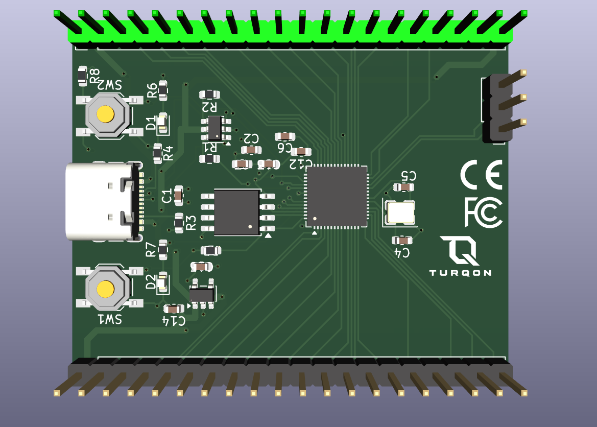
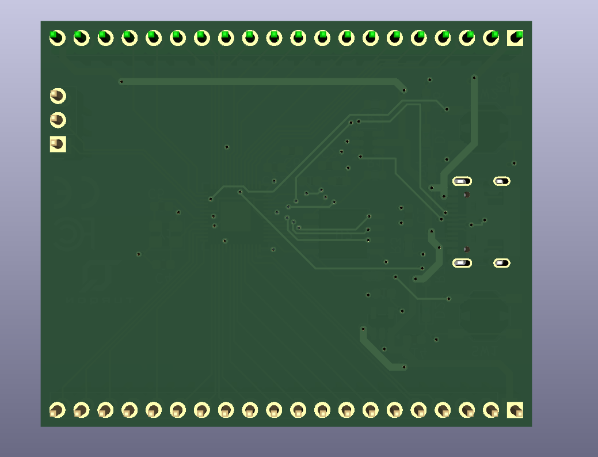

# ⚡ MDC RP2040 - Custom 4-Layer Development Board

A compact, industrial-standard 4-layer custom microcontroller development board powered by the **Raspberry Pi RP2040**. Built for high signal integrity, low-noise power distribution, and full hardware ESD protection.

---

## 📸 Hardware Overview

| Top View | Bottom View |
| :---: | :---: |
|  |  |

---

## 🛠 Key Hardware Specifications

* **Microcontroller:** Raspberry Pi RP2040 (Dual ARM Cortex-M0+ @ 133 MHz, 264 KB SRAM)
* **Flash Memory:** 16 MB (128 Mb) Winbond QSPI Flash (`W25Q128JVSIQ`)
* **Power Regulation:**
  * High-performance 600 mA 3.3V LDO regulator (`AP2112K-3.3`)
  * Low ESR ceramic decoupling network across all internal power rails (`DVDD 1.1V`, `IOVDD 3.3V`, `ADC_AVDD 3.3V`)
* **USB Interface:** USB Type-C 2.0 with dedicated ESD protection (`USBLC6-2SC6`) and dual 5.1 kΩ CC configuration resistors
* **Clock System:** 12 MHz surface-mount crystal oscillator with dedicated symmetrical load capacitor array (`27 pF`) and isolated ground shielding
* **I/O & Peripherals:**
  * Standard 2.54 mm dual-row pinout exposing 30 multi-function GPIOs (SPI, I2C, UART, PWM, ADC)
  * Dedicated 3-pin SWD interface (`SWCLK`, `SWDIO`, `GND`) for debug probes (Picoprobe / J-Link)
  * Hardware `BOOT` and `RESET` pushbuttons
  * Status LEDs for `Power` (+3.3V) and user-programmable indicator (`GPIO25`)

---

## 📐 PCB Layer Stack-up (4-Layer FR-4)

Designed adhering to standard 1.6 mm PCB manufacturing guidelines (e.g., JLCPCB JLC04161H / PCBWay):

| Layer | Type | Copper Thickness | Function / Allocation |
| :--- | :--- | :--- | :--- |
| **Layer 1 (F.Cu)** | Signal | 1.0 oz (35 µm) | Core ICs, high-speed USB differential pairs, QSPI routing, and local decoupling loops |
| **Layer 2 (In1.Cu)** | Plane | 0.5 oz (17.5 µm) | **Unbroken Solid Ground Plane (GND)** for optimal return path and EMI shielding |
| **Layer 3 (In2.Cu)** | Power | 0.5 oz (17.5 µm) | Dedicated **+3.3V & +1.1V Power Planes** |
| **Layer 4 (B.Cu)** | Signal / GND | 1.0 oz (35 µm) | Low-speed signal breakout paths with unbroken ground copper pour |

---

## 📁 Repository Structure

```text
├── docs/                   # Renderings, hardware design schematics (PDF), and pinout guides
│   └── images/             # 3D PCB board renders
├── hardware/               # KiCad project files (.kicad_pro, .kicad_sch, .kicad_pcb)
├── manufacturing/          # Production-ready Gerbers, Drill files, BOM, and CPL files
├── .gitignore              # KiCad workspace exclusion rules
└── README.md
